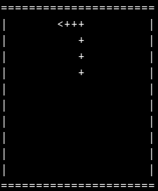
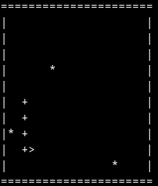

snake clone  
a simple clone of snake running in the terminal via ncurses and coded in lua.  

## installation 
before running the game for the first time, run the make file located in libs/ncurses to compile the shared C library which is used for ncurses functionality. 
```
cd libs/ncurses 
make 
```

## controls
- 'w' move up  
- 'a' move left  
- 's' move down  
- 'd' move right  

## screenshots 
  
  

## requirements
- [lua](https://lua.org) >= 5.4
- [ncurses](https://invisible-island.net/ncurses/ncurses.html)
- [gcc](https://gcc.gnu.org/)  (or you can use a different C compiler of your choice. you will need to change this in the make file)
- ncurses compatible terminal

## libraries used
- [tick](https://github.com/rxi/tick)
- [ncurses](https://invisible-island.net/ncurses/ncurses.html)
